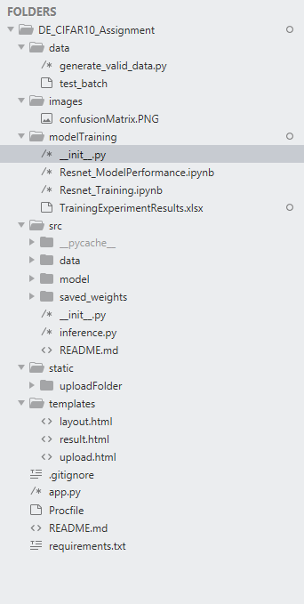
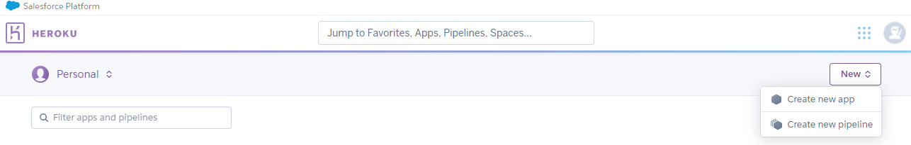
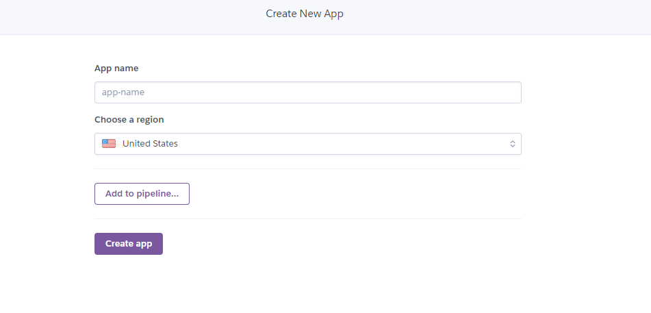
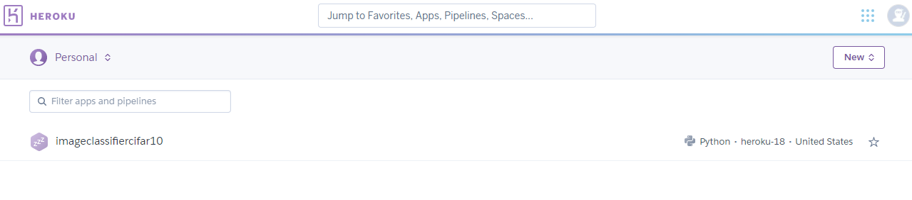
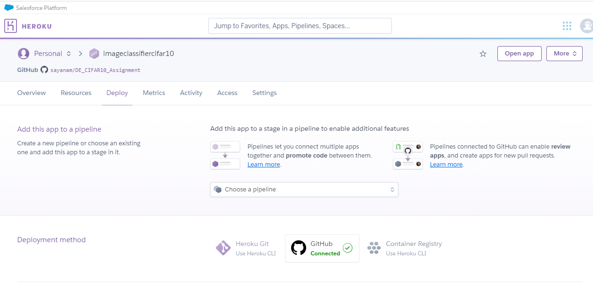
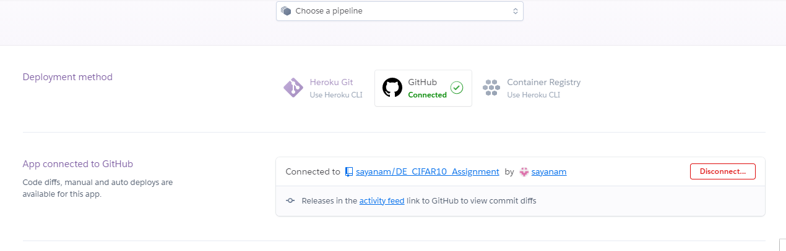
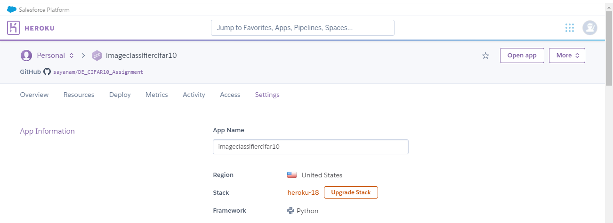
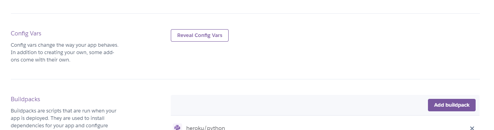
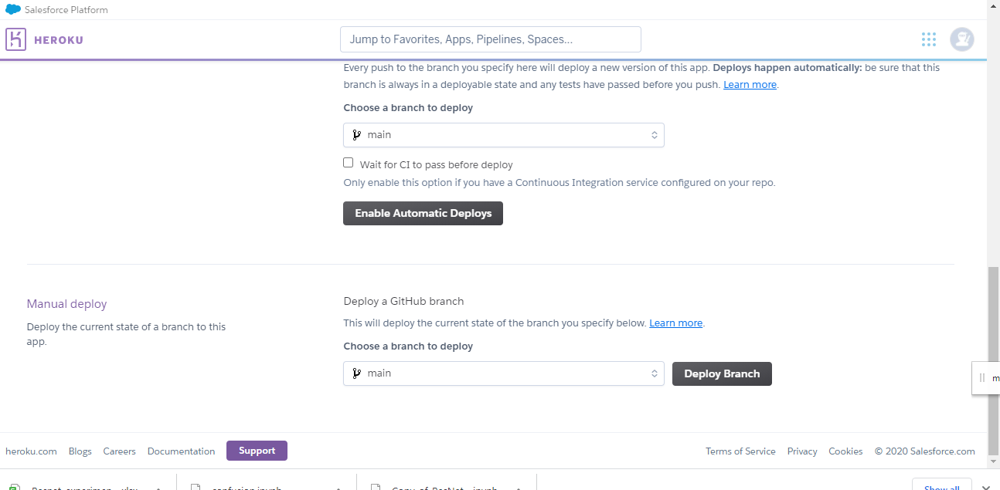
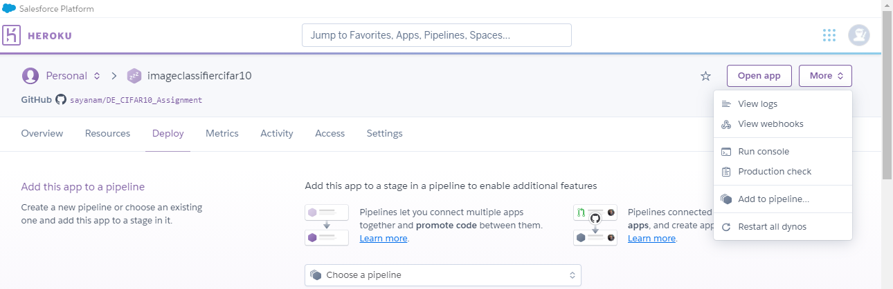

# DE_CIFAR10_Assignment
Resnet on CIFAR10 Image dataset
================================

1) Built Resnet-18 Architecture. 
2) Trained the model with CIFAR10 dataset
3) Various experiments were conducted by configuring values of parameters such as Image Augmentation, Normalization, Optimizers and Dropout. The results are available in modelTraining\TrainingExperimentResults.xlsx
4) The best model with image augmentation, normlization, SGD with dynamic learning rate and dropout(0.25). 
5) The model was trained for 200 eppoch with the best accuracy of 90.98 on test data.
6) The following per class accuracy on test data were obtained. 

					aeroplane: 0.86
					automobile: 0.96
					bird: 0.865
					cat: 0.762
					deer: 0.916
					dog: 0.85
					frog: 0.947
					horse: 0.935
					ship: 0.951
					truck: 0.935
	with confusion matrix of :
	
       
	
	Inferences:
		Ships and automobiles have the highest accuracy amoung all the classes
		Cats are being misclassified as dogs and vice versa.

7) Application Information

## Directory



## Training 
Use [Training Notebook](modelTraining/Resnet_Training.ipynb) and [Model Performance](modelTraining/Resnet_ModelPerformance.ipynb)

## Setting up the Environment

To setup the environment 
```bash
python3 -m pip install -U virtualenv # install the virtualenv
virtualenv -p python3 dev_env # creating an environment
source dev_env/bin/activate # activate environment
git clone https://github.com/sayanam/DE_CIFAR10_Assignment #clone the repo
cd DE_CIFAR10_Assignment
pip install -r requirements.txt # install the requirements
```

## For Inference
 To generate validation data run the below code:
```bash
cd data
python generate_valid_data.py
```

## Run application using Flask
Run the below command to commence the application
```bash
python flask_api/app.py
```
8) How to use the application?


9) Deployment in HEROKU
## Configuring HEROKU
Note: requirement.txt and Procfile are required to be present in the project workspace for Hiroku to identify the initial file that has to run.
	a) Sign-up for Heroku at https://devcenter.heroku.com/ and agree to all the necessary terms and conditions.
	b) In the home page click on New -> Create a new app.

	c) Enter the app name and click on Create app

	d) Selected the selected app

	e) Select Deploy tab and connect to the github and configure the repository from which the code has to be deployed



	f) Select settings and click on Add buildpack and select python


	e) Goto Deploy tab again and click on to 

	f) Click Open app for the app to open.

Note: How to check application logs ??
Select More --> View Logs


	


